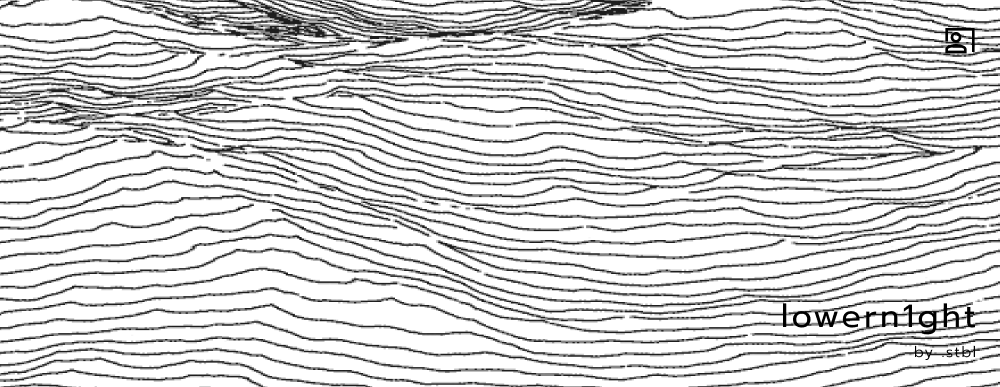



---

  <strong>part of <a href="https://github.com/dot-stbl">.stbl</a></strong> &nbsp;·&nbsp;
  <a href="https://stbl.space">stbl.space</a>

---

### [My resume](https://github.com/lowern1ght/resume-lwnight)

Open source infrastructure software — see <a href="https://github.com/dot-stbl">github.com/dot-stbl</a> for the full list of repositories.

I'm open to joint projects — drop a line. Glad to see you here.

---

<code>.stbl</code> — the hidden file at the bottom of every product we ship.
